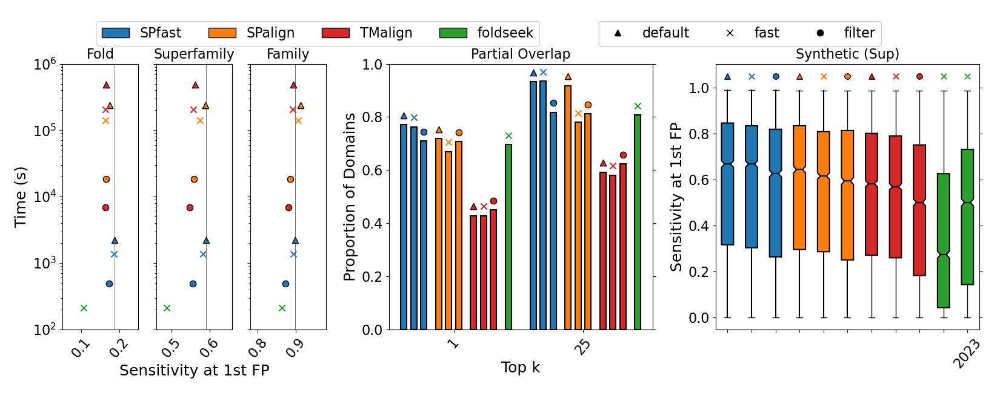

# SPfast: Ultra-fast and highly sensitive protein structure alignment with segment-level representations and block-sparse optimization

<p align="center"></p>

# Contents
- [Demo](#Demo)
- [Setup](#setup)
- [Usage](#usage)
- [Parameters](#parameters)
- [Output Formats](#output-formats)
- [PyMOL Plugin](#pymol-plugin)
- [References](#references)

## Demo
|   Notebook                                                                                                                   | Data                                                                                 | Description                                                                                |
|:-----------------------------------------------------------------------------------------------------------------------------|--------------------------------------------------------------------------------------|--------------------------------------------------------------------------------------------|
|[Structure search](https://colab.research.google.com/github/tlitfin/SPfast/blob/main/notebooks/SPfast_AFDB_clusters_db.ipynb) | [afdb-clu.db](https://spfast.tomlitfin.workers.dev/afdb-clu.db.tar.gz) (6GB)         | Search structure database of 2.3M AFDB clusters representatives                                     |
|[PFAM annotation](https://colab.research.google.com/github/tlitfin/SPfast/blob/main/notebooks/SPfast_AFDB_clusters_PFAM.ipynb)  | [afdb-clu-annot.db](https://spfast.tomlitfin.workers.dev/afdb-clu-annot.db.tar.gz) (2GB) | Annotate function by structure-based search of 375k curated AFDB clusters PFAM annotations |


**Note:** SPfast is suited to multi-core CPUs and not optimized for colab execution

## Setup

1. Create python environment to process PDB format structures to SPfast-compatible structure files

    ```
    conda create -n SPfast
    conda activate SPfast
    conda install pybind11 scikit-learn biopython numpy python=3.8 -c conda-forge
    ```

2. Install SPlib python library
    ```
    pip install ./SPfast/
    ```
    - **NOTE:** Python bindings are provided in SPlib but are not suitable for efficient database search


3. Compile SPfast and prepare_bin binaries
    ```
    cd SPfast/src
    make gnu
    cd ../../
    ```

4. Install DSSP to extract secondary structures labels.
    ```
    wget https://github.com/PDB-REDO/dssp/releases/download/v4.4.0/mkdssp-4.4.0-linux-x64 && chmod +x mkdssp-4.4.0-linux-x64
    ```
   - **NOTE**: Results in paper were produced with legacy dssp-2.0.4-linux-amd64

## Usage
### Preprocess structures
```
# Precompute representative pseudoatoms
python ../utils/idealize.py example_list --structure_suffix ent 
```
```
# Convert to binary format
../src/prepare_bin.gnu -qlist ideal/ example_list .ideal

## OR ##

# Database format to avoid many small files
../src/prepare_bin.gnu -qlist ideal/ example_list .ideal -tdb example.db > example.db.index

# Extract entries from database
../src/extract_bin.gnu example.db ./ -q d1qo0d_.ideal
../src/extract_bin.gnu example.db ./ -qlist example_list .ideal
```
### Structure Search
```
# Search all-vs-all
../src/SPfast.gnu -qlist ideal/ example_list .ideal.bin -tlist ideal/ example_list .ideal.bin

# Search against database
../src/SPfast.gnu -q ideal/d1ktga_.ideal.bin -tdb example.db

# Search a list of pairs
../src/SPfast.gnu -plist example_pairs -idir ideal/
```

Both query and database entries can be provided with flags or as positional arguments:
```
SPfast.gnu -qlist /path/to/ id_list .suffix -tlist /path/to/ id_list .suffix
SPfast.gnu -q /path/to/id.suffix -t /path/to/id.suffix
SPfast.gnu /path/to/id.suffix /path/to/id.suffix
```

## Parameters
Note: The most impactful parameters for improving sensitivity are ssprefcut >> coarsecut > finalgap0 > convergence_criterion > segcut ~ riters

* **-SPscore**:
Use original SPscore parameters rather than newly optimized parameters.
* **-ssprefcut**: Default: 0.35\
Threshold for SS-segment based alignment prefilter. (Not very impactful unless used in conjunction with -singledom)
* **-coarsecut**: Default: -1.0\
Threshold for coarse-grained segment-based SPscore filter.
* **-singledom**:\
Indicator that alignments are between single domains. (Allows strict pre-filtering based on SS)
* **-finalgap0**: Default: 0.2\
Gap open penalty for final alignment. (Must be >0. Unlikely to be effective if >0.5 since 0.5 is used for intermediate steps). Larger values produce better local alignments.
* **-convergence_criterion**: Default: 0.05\
Amount of improvement over best alignment required to stop iterating between alignment and superimposing.
* **-segcut**: Default: 5.0\
Maxmimum RMSD between seed fragments. (higher threshold means increased sensitivity and slower execution)
* **-riters**: Default: 1\
Number of superimposing iterations to convergence for a given alignment

## Reporting
* **-iprint 1**:
Display alignment scores only
* **-iprint 2**
Display alignment scores and transformation matrix
* **-iprint 3**
Display alignment scores, transformation matrix and alignment
* **-reportcutoff**
Filter output results by minimum score threshold

## PyMOL Plugin
We have included a PyMOL plugin to enable pairwise alignment within PyMOL similar to builtin align/cealign functionality. The plugin can be installed with the Plugin Manager using the URL of this repository and the SPfast.py script. SPlib *must* be first installed with pip.\
The alignment can be conducted within the PyMOL terminal with the following syntax:
```
SPfast moving.pdb stationary.pdb
```

## References
If you use this tool, please cite:

- Litfin, T, Zhou, Y, von Itzstein, M. (2025). Ultra-fast and highly sensitive protein structure alignment with segment-level representations and block-sparse optimization. bioRxiv. doi:10.1101/2025.03.14.643159.

The source code is adapted from:

- Yang, Y, Zhan, J, Zhao, H & Zhou, Y. (2012). 
A new size-independent score for pairwise protein structure alignment and its application to structure classification and nucleic-acid binding prediction. 
Proteins. 80(8), 2080-2088.

Optimum rotations are computed using the implementation described in:

- Theobald, D. (2005).
Rapid calculation of RMSD using a quaternion-based characteristic polynomial.
Acta Crystallographica A. 61(4), 478-480.

- Liu, P, Agrafiotis, D & Theobald, D. (2009).
Fast determination of the optimal rotational matrix for macromolecular superpositions.
Journal of Computational Chemistry. 31(7). 1561-1563.

Reference data is described:
- Barrio-Hernandez, I., Yeo, J., Jänes, J. et al. (2023). Clustering predicted structures at the scale of the known protein universe. Nature. 622, 637–645. 