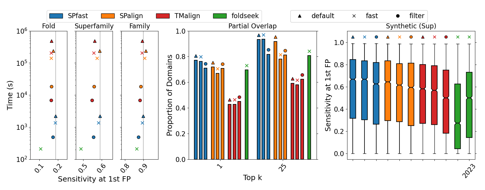

# SPfast
Ultra-fast and highly sensitive protein structure alignment with segment-level representations and block-sparse optimization.

<p align="center"></p>

## Contents
- [Demo notebooks](#demo-notebooks)
- [Setup](#setup)
- [Quick start (example data)](#quick-start-example-data)
- [Search modes](#search-modes)
- [Important parameters](#important-parameters)
- [Reporting options](#reporting-options)
- [PyMOL plugin](#pymol-plugin)
- [References](#references)

## Demo notebooks
| Notebook | Data | Description |
|:---|:---|:---|
| [Structure search](https://colab.research.google.com/github/tlitfin/SPfast/blob/main/notebooks/SPfast_AFDB_clusters_db.ipynb) | [afdb-clu.db](https://spfast.tomlitfin.workers.dev/afdb-clu.db.tar.gz) (6 GB)<br>[BFVD.db](https://spfast.tomlitfin.workers.dev/BFVD.db.tar.gz) (670 MB) | Search a structure database of predicted cluster representatives |
| [PFAM annotation](https://colab.research.google.com/github/tlitfin/SPfast/blob/main/notebooks/SPfast_AFDB_clusters_PFAM.ipynb) | [afdb-clu-annot.db](https://spfast.tomlitfin.workers.dev/afdb-clu-annot.db.tar.gz) (2 GB) | Annotate protein function by structure search over 375k curated AFDB clusters |

Note: SPfast is designed for multi-core CPUs and is not optimized for Colab.

## Setup
Commands below assume you are in the repository root.

1. Create an environment for preprocessing structures (`utils/idealize.py`) and PyMOL bindings:
```bash
conda create -n spfast python=3.8 -c conda-forge
conda activate spfast
conda install -c conda-forge pybind11 scikit-learn biopython numpy
```

2. Install the Python extension module (`SPlib`):
```bash
pip install .
```
Note: `SPlib` Python bindings are useful for preprocessing and the PyMOL plugin. High-throughput searches should use the compiled binaries below.

3. Build command-line binaries:
```bash
make -C src gnu
```
This produces:
- `src/SPfast.gnu`
- `src/prepare_bin.gnu`
- `src/extract_bin.gnu`

4. Install DSSP for external secondary-structure labels:
```bash
wget https://github.com/PDB-REDO/dssp/releases/download/v4.4.0/mkdssp-4.4.0-linux-x64
chmod +x mkdssp-4.4.0-linux-x64
```
Paper results were produced with `dssp-2.0.4-linux-amd64`.

## Quick start (example data)
This reproduces the full pipeline on files under `example/`. The required starting inputs are a directory of structure files and a directory of corresponding DSSP secondary structure annotation files.

1. Generate `.ideal` files from structures:
```bash
python utils/idealize.py example/example_list \
  --sdir example/structures \
  --dssdir example/DSSP \
  --odir example/ideal \
  --structure_suffix ent
```

2. Convert `.ideal` files to `.ideal.bin` files:
```bash
src/prepare_bin.gnu -qlist example/ideal example/example_list .ideal
```

3. Build a packed database (single file + index):
```bash
src/prepare_bin.gnu -qlist example/ideal example/example_list .ideal -tdb example/example.db > example/example.db.index
```

4. Extract entries from the database (optional):
```bash
src/extract_bin.gnu example/example.db example/ideal -q d1qo0d_.ideal
src/extract_bin.gnu example/example.db example/ideal -qlist example/example_list .ideal
```

## Search modes
All commands assume paths from repository root.

All-vs-all between two lists:
```bash
src/SPfast.gnu -qlist example/ideal example/example_list .ideal.bin \
  -tlist example/ideal example/example_list .ideal.bin
```

Query against packed database:
```bash
src/SPfast.gnu -q example/ideal/d1ktga_.ideal.bin -tdb example/example.db
```

List of explicit pairs (`query target` per line):
```bash
src/SPfast.gnu -plist example/example_pairs -idir example/ideal
```

Unique pairwise all-vs-all within one list (`N*(N-1)/2` comparisons):
```bash
src/SPfast.gnu -pairlist example/ideal example/example_list .ideal.bin
```

Pairwise single comparison:
```bash
src/SPfast.gnu example/ideal/d1ktga_.ideal.bin example/ideal/d1xria_.ideal.bin
```

## Important parameters
Most impactful sensitivity controls (roughly): `-ssprefcut` >> `-coarsecut` > `-finalgap0` > `-converge` > `-segcut` ~ `-riters`.

- `-SPscore`: use original SPscore parameters instead of optimized defaults.
- `-ssprefcut` (default `-1`): threshold for SS-segment prefiltering; most useful with `-singledom`.
- `-coarsecut` (default `-1`): coarse segment-based score cutoff.
- `-singledom`: assume single-domain proteins; enables stricter SS-based prefiltering.
- `-finalgap0` (default `0.2`): final-stage gap-open penalty (must be > 0).
- `-converge` (default `0.05`): stop criterion for iterative alignment/superposition refinement.
- `-segcut` (default `5.0`): maximum RMSD for seed fragments (higher = more sensitive, slower).
- `-riters` (default `1`): number of refinement iterations.
- `-fast`: speed-focused preset (`-converge 0.9 -coarsecut 5.5 -segcut 4.0`).

## Reporting options
- `-reportcutoff X`: print only results with score >= `X` (for SPscore output).

### `-iprint 1` (single-line summary)
Prints one result line per comparison.

```text
query target SPscore Rawscore SSscore nA nB Le SeqID Nali seeds valid_seeds coarse
```

Field meanings:
- `SPscore`: effective SPscore (main ranking score).
- `Rawscore`: unnormalized SPscore.
- `SSscore`: Secondary structure prefilter score.
- `nA`, `nB`: query/target lengths.
- `Le`: effective aligned length.
- `SeqID`: sequence identity (%).
- `Nali`: number of aligned residue pairs.
- `seeds`, `valid_seeds`: sampled and retained seed counts.
- `coarse`: coarse-stage score.

### `-iprint 2` (summary + transform)
Includes everything from `-iprint 1`, then appends a 3-line rigid transform:
```text
t_x r11 r12 r13
t_y r21 r22 r23
t_z r31 r32 r33
```
Where `t_*` is translation and `r**` is the rotation matrix.

### `-iprint 3` (summary + transform + alignment)
Includes everything from `-iprint 2`, then appends a 3-line sequence alignment block:
```text
<query_start> <query_aligned_sequence> <query_end>
             <match_quality_markers>
<target_start> <target_aligned_sequence> <target_end>
```
Marker legend:
- `:` aligned pair distance <= 4 A
- `;` aligned pair distance < 5 A
- `.` aligned pair distance < 8 A
- space: no close structural match at that position

## PyMOL plugin
`SPfast.py` provides a pairwise alignment command for PyMOL (similar usage to `align`/`cealign`).

1. Install `SPlib` first (`pip install .`).
2. Install `SPfast.py` through the PyMOL Plugin Manager from this repository URL.
3. Run from the PyMOL terminal:
```text
SPfast moving_selection, stationary_selection
```

## References
If you use this tool, please cite:

- Litfin, T, Zhou, Y, von Itzstein, M. (2025). Ultra-fast and highly sensitive protein structure alignment with segment-level representations and block-sparse optimization. bioRxiv. doi:10.1101/2025.03.14.643159.

Source code is adapted from:

- Yang, Y, Zhan, J, Zhao, H, Zhou, Y. (2012). A new size-independent score for pairwise protein structure alignment and its application to structure classification and nucleic-acid binding prediction. Proteins. 80(8), 2080-2088.

Optimum rotations are computed using:

- Theobald, D. (2005). Rapid calculation of RMSD using a quaternion-based characteristic polynomial. Acta Crystallographica A. 61(4), 478-480.
- Liu, P, Agrafiotis, D, Theobald, D. (2009). Fast determination of the optimal rotational matrix for macromolecular superpositions. Journal of Computational Chemistry. 31(7), 1561-1563.

Reference clustering data:

- Barrio-Hernandez, I., Yeo, J., Janes, J. et al. (2023). Clustering predicted structures at the scale of the known protein universe. Nature. 622, 637-645.
